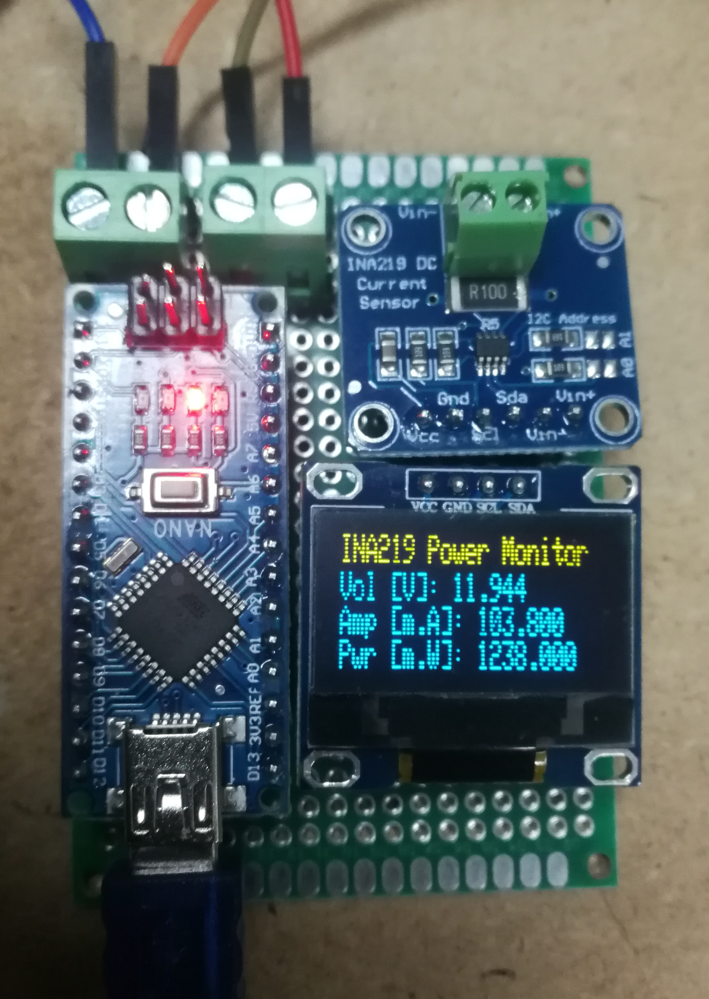
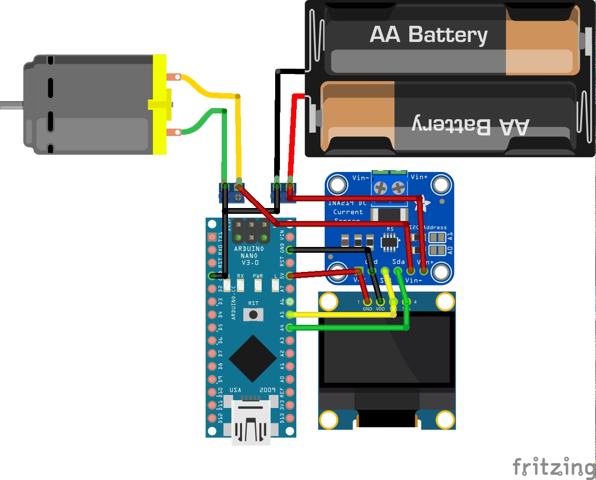

# Watt_Meter_Arduino_INA219

Watt meter based on an arduino and a INA219 module. The capability of the INA219 is as follows:
* Senses Bus Voltages from 0 to 26 V
* Supports up to ±3.2A current measurement, with ±0.8mA resolution

**Working Principle**
* Connect the module to the power source and the load.
* Power the arduino via the usb port.
* Read the output on the OLED screen.

**Components:**
* Arduino Nano
* INA219
* OLED 128x64 I2C (The pinout of the module I used has the pinout labels difference than what is shown on the schematic diagram. Strict to the wiring on the schematic.)

